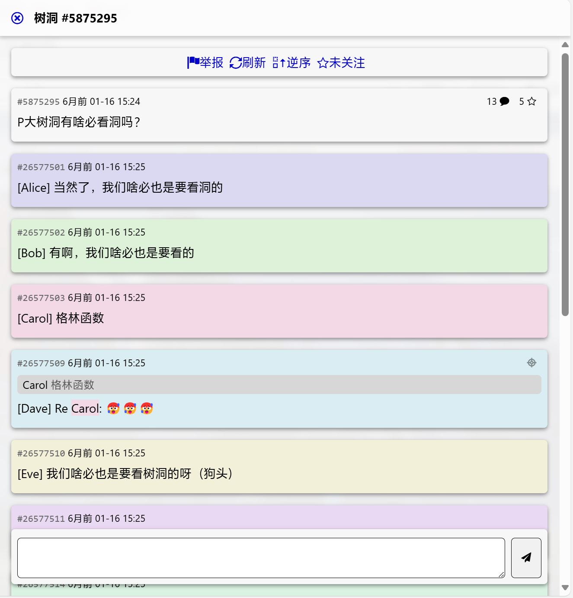
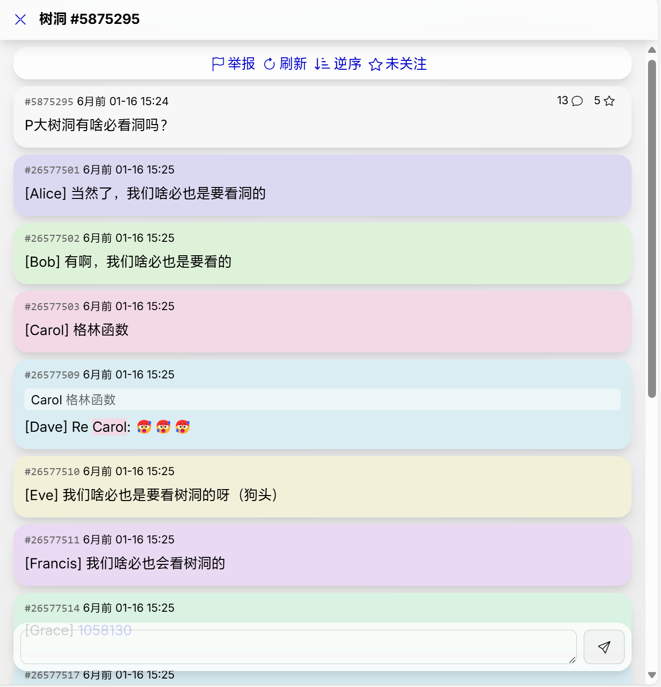

# PKU TheeMole

小登试图整顿树洞 UI，这是他的网页发生的变化：

## How to use
### Chrome/Edge/Other Chromium/Firefox
1. 下载并安装 Stylus 扩展程序
2. 从[此处](https://userstyles.world/style/17613/pku-theemole)获取 UserStyle

### Safari
> [!NOTE]
> 此方法不支持 UserStyle 自定义

1. 从 [App Store](https://apps.apple.com/cn/app/stay-for-safari-%E6%B5%8F%E8%A7%88%E5%99%A8%E4%BC%B4%E4%BE%A3/id1591620171) 获取 Stay
2. 下载并导入 stay-inject.js

## 截图
### 主页
Before:

After:

### 树洞详情页
Before:

After:

## Changelogs
### 0.3 (2024-8-15)
- “还有 * 条”按钮的样式修复
- 回复框的样式修复

### 0.2 (2024-8-8)
- 修复图标缺失
- 现在可以调整背景模糊 (UserStyle)
- 现在可以分别调整浅色与深色模式下的主题色 (UserStyle)

### 0.1 (2024-8-7)
- Initial release.